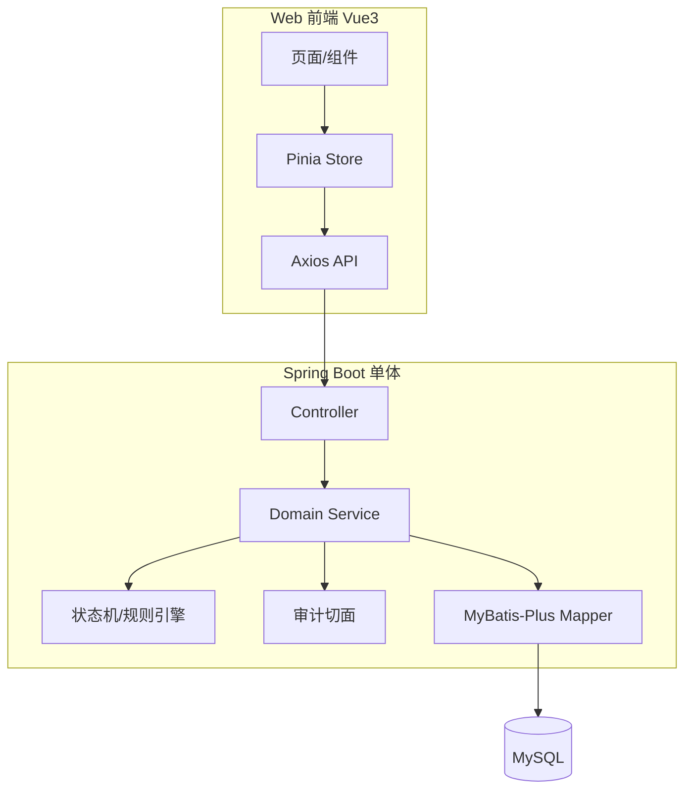

# 酒店客房管理系统 — 技术实现方案（MVP）

| 文档属性 | 说明 |
|----------|------|
| 版本 | v1.0 |
| 状态 | 可实施基线 |
| 需求基线 | [`spec.md`](./spec.md) v1.0 |
| 工程约束 | [`../AGENTS.md`](../AGENTS.md) |
| 目标读者 | 研发、测试、AI 代码生成 |

本文档将 **每一条 MVP 能力** 映射到模块、数据模型、接口、页面与任务 ID，供后续拆分 Story、OpenAPI、用例与代码生成使用。

---

## 1. 方案总览

### 1.1 架构形态

| 项 | 决策 | 理由（spec 对齐） |
|----|------|------------------|
| 部署形态 | **单体前后端分离** | 单店 &lt;50 间，无多租户/OTA，复杂度可控 |
| 后端 | Spring Boot 2.7.x + MyBatis-Plus | AGENTS.md |
| 前端 | Vue 3 + Vite + Element Plus + Pinia + Vue Router | AGENTS.md |
| 数据库 | MySQL 8.0，InnoDB，utf8mb4 | AGENTS.md |
| 鉴权 | Spring Security + **JWT**（无状态 API） | 账号不绑工号，审计记 `user_id`/`username` |
| 事务 | 核心业务 `@Transactional` | 入住/退房/换房/结班需原子性 |
| 并发 | 乐观锁 `room.version` + 业务状态机校验 | BR-01、BR-02、防重复入住 |
| 定时任务 | **不启用**自动 No-show | spec §6.4、BR-03 |

### 1.2 逻辑架构图



### 1.3 仓库目录规划（实施时创建）

```
Guest Room Management/
├── specs/
│   ├── spec.md
│   └── plan.md
├── backend/                    # Spring Boot
│   └── src/main/java/com/hotel/grms/
│       ├── config/
│       ├── security/
│       ├── common/               # 统一响应、异常、枚举
│       ├── module/
│       │   ├── auth/
│       │   ├── system/           # 用户角色权限、配置、审计
│       │   ├── room/
│       │   ├── reservation/
│       │   ├── stay/             # 在住、Walk-in、换房
│       │   ├── billing/          # 账单、支付、计价
│       │   ├── housekeeping/
│       │   └── shift/            # 开班交班
│       └── GrmsApplication.java
├── frontend/
│   └── src/
│       ├── api/
│       ├── views/
│       ├── components/
│       ├── stores/
│       └── router/
└── sql/
    └── V1__init_schema.sql       # 仅 CREATE，禁止 DROP
```

### 1.4 待确认项（OQ）— 本方案默认取值

> 实现与测试以本表为准；若业务变更，先改 `spec.md` 再改本表。

| OQ | 默认决策 | 影响模块 |
|----|----------|----------|
| OQ-01 | **按晚计费**；入住日至离店日前一晚为计费晚数；**离店当天不计费** | `billing` |
| OQ-02 | 房态图：**展示态**（按查看日+预订时刻）+ **库内主状态**（操作）+ 当日标签 | `room` |
| OQ-06 | 预订 **arrival_at / departure_at**；默认 18:00 / 12:00；冲突含 **1h 打扫缓冲** | `reservation` |
| OQ-03 | 前台须 **开班** 后收款计入当前班；**结班** 时若有待办则阻断或需 `shift:force_close` 权限 | `shift` |
| OQ-04 | 钟点房/半日房 **不做** | — |
| OQ-05 | 房型门市价修改 **即时全局生效**（不影响已结账单） | `room` |

---

## 2. 需求追踪矩阵（Spec → Plan）

### 2.1 模块级追踪

| Plan 模块 ID | 名称 | Spec 章节 | MVP |
|--------------|------|-----------|-----|
| MOD-AUTH | 认证会话 | §10.2 | Y |
| MOD-RBAC | 用户角色权限 | §3、§10.1、§10.3 | Y |
| MOD-ROOM | 房型客房房态 | §5、§4.2–4.3 | Y |
| MOD-RES | 预订 | §6 | Y |
| MOD-STAY | 入住/在住/换房 | §7 | Y |
| MOD-BILL | 账单计价退房支付 | §8 | Y |
| MOD-HK | 保洁 | §9 | Y |
| MOD-SHIFT | 开班交班 | §11.1 | Y |
| MOD-STAT | 轻量统计 | §11.2 | Y |
| MOD-AUDIT | 操作审计 | §10.3 | Y |
| MOD-MEMBER | 会员 | §2.3 | N |
| MOD-DASH | 看板 | §2.3、§11.2 | N |

### 2.2 业务规则追踪（BR → 技术落点）

| BR | 规则摘要 | 技术落点 |
|----|----------|----------|
| BR-01 | 禁止超售 | `RoomAvailabilityService.checkAssignable()`；预订排房/入住前调用 |
| BR-02 | 非可售不可入住 | `RoomStateMachine.assertCheckInAllowed()`；`PERM_ROOM_FORCE_STATUS` 例外 |
| BR-03 | 预订手动释放 | `ReservationService.release()`；无定时任务 |
| BR-04 | 取消无罚金 | 账单层不生成取消费用项 |
| BR-05 | 改价须权限 | `@PreAuthorize` + `PERM_PRICE_ADJUST` |
| BR-06 | 换房整段重算 | `BillingService.recalculateFullStay()` |
| BR-07 | 退房须结清 | `CheckoutService` 校验应付=已付 |
| BR-08 | 无押金 | 数据模型无押金字段 |
| BR-09 | 自然日营业日 | `BusinessDateProvider.today()` = `LocalDate.now()` |
| BR-10 | 脏房→保洁→空净 | 脏房 INSERT `hk_task`；完成 CLOSE task + `room.status=VACANT_CLEAN` |
| BR-11 | 维修必填 | `RoomService.setMaintenance(reason, eta)` 校验非空 |
| BR-12 | 账号不绑工号 | `sys_user` 仅 `username/password/status`；审计记 `operator_id` |

---

## 3. 领域模型与状态机

### 3.1 核心实体关系（ER 摘要）

```
room_type 1──* room
reservation *──0..1 room (pre_assign_room_id)
reservation 1──0..1 stay_order
stay_order 1──* stay_guest (MVP 主客人 1 条即可)
stay_order 1──1 folio
folio 1──* folio_line
folio 1──* payment
room 1──* hk_task (进行中)
shift_session 1──* payment (shift_id)
sys_user *──* sys_role
sys_role *──* sys_permission
sys_user *──* sys_permission (敏感权限直授)
operation_log (业务_id 多态)
```

### 3.2 枚举定义（前后端共用约定）

**占用态 `room.status`**

| 枚举值 | 中文 | Spec |
|--------|------|------|
| `VACANT` | 空房 | §4.2 |
| `RESERVED` | 预订锁定 | §4.2 |
| `OCCUPIED` | 在住 | §4.2 |
| `OUT_OF_ORDER` | 维修 | §4.2 |

**保洁态 `room.clean_status`**

| 枚举值 | 中文 | Spec |
|--------|------|------|
| `CLEAN` | 净 | §4.2 |
| `DIRTY` | 脏 | §4.2 |

> 迁移前历史值 `VACANT_CLEAN`/`DIRTY` 作占用态已废弃，由 V14 脚本拆分。

**当日叠加标签 `room.daily_tags`（计算字段，非持久化主状态）**

| 标签 | 条件 |
|------|------|
| `EXPECTED_ARRIVAL` | 存在已确认预订，`DATE(arrival_at) = 查看日`，未入住 |
| `EXPECTED_DEPARTURE` | 存在在住或有效预订，`DATE(departure_at) = 查看日` |

**房态图展示态 `display_status`（计算字段）**

| 条件 | 展示态 |
|------|--------|
| 查看日落在在住 `arrival_date~departure_date` 内 | `OCCUPIED`（优先于库内脏/空净） |
| 查看日落在有效预订占用区间且已 `room_id` | `RESERVED`（优先于库内脏/空净） |
| 库内 `RESERVED` 但查看日不在上述区间 | `VACANT`（展示用） |
| 库内 `OCCUPIED` 但查看日不在在住区间 | `VACANT`（展示用） |
| 其他 | 与库内占用态一致 |

占用区间重叠判定（排房/可售）：`existing.arrival_at < new.departure_at + 1h` 且 `new.arrival_at < existing.departure_at + 1h`。

**预订状态 `reservation.status`**

`PENDING` → `CONFIRMED` → (`CHECKED_IN` | `CANCELLED` | `NO_SHOW` | `RELEASED`)

**在住单 `stay_order.status`**

`IN_HOUSE` → `CHECKED_OUT`

**保洁任务 `hk_task.status`**

`PENDING` → `DONE`（完成后删除或归档，房间变空净）

**支付方式 `payment.method`**

`CASH` | `WECHAT` | `ALIPAY`

### 3.3 客房状态机（转换表）

| 自 | 事件 | 至 | 角色/权限 |
|----|------|-----|-----------|
| VACANT_CLEAN | 预订预排房 | RESERVED | 前台 |
| RESERVED | 释放预订/取消/No-show | VACANT_CLEAN | 前台 |
| VACANT_CLEAN | 入住 | OCCUPIED | 前台 |
| RESERVED | 预订入住 | OCCUPIED | 前台 |
| OCCUPIED | 退房 | DIRTY | 前台 |
| DIRTY | 保洁完成 | VACANT_CLEAN | 保洁 |
| * | 设维修 | OUT_OF_ORDER | 前台/店长；原因+ETA 必填 |
| OUT_OF_ORDER | 维修结束(前台选) | DIRTY 或 VACANT_CLEAN | 前台；建议脏房 |
| * | 强制改态 | 任意 | `PERM_ROOM_FORCE_STATUS` + 审计 |

实现类：`com.hotel.grms.module.room.state.RoomStateMachine`（单表驱动，**禁止嵌套循环**遍历全表；按 `roomId` 单条处理）。

### 3.4 核心业务流程（服务编排）

#### 3.4.1 预订预排房 — `ReservationService.assignRoom`

1. 校验日期、房型；
2. `RoomAvailabilityService`：目标房 `VACANT_CLEAN` 且该区间无冲突预订/在住（BR-01）；
3. 更新 `reservation.room_id`，`room.status = RESERVED`；
4. 写 `operation_log`。

#### 3.4.2 Walk-in 入住 — `StayService.checkInWalkIn`

1. 校验当前用户 `shift_session` 为 OPEN（OQ-03）；
2. `RoomStateMachine.assertCheckInAllowed(room)`；
3. 创建 `stay_order`、`stay_guest`、`folio`；
4. `BillingService.initFolioLines()` 按晚生成房费行；
5. `room.status = OCCUPIED`；
6. 审计。

#### 3.4.3 预订入住 — `StayService.checkInFromReservation`

1. 预订状态 `CONFIRMED` 且已排房；
2. 冲突校验（维修、在住等）；
3. 同上创建在住单；预订 → `CHECKED_IN`；
4. 若房间为 `RESERVED` → `OCCUPIED`。

#### 3.4.4 换房 — `StayService.changeRoom`

1. 目标房 `assertCheckInAllowed`；
2. 原房 → `DIRTY`（或 `VACANT_CLEAN` 若业务配置「换房不脏原房」— **默认原房变脏房**）；
3. 更新 `stay_order.room_id`、房型快照字段；
4. `BillingService.recalculateFullStay(stayOrderId)`（BR-06）；
5. 审计。

#### 3.4.5 退房 — `CheckoutService.checkout`

1. `BillingService.recalculateFullStay` 最终计价；
2. 校验 `folio.balance == 0`（BR-07）；
3. `stay_order.status = CHECKED_OUT`；
4. `room.status = DIRTY` → 创建 `hk_task`；
5. 支付记录关联 `shift_session_id`；
6. 审计。

#### 3.4.6 手动释放预订 — `ReservationService.release`

1. 状态 → `RELEASED` 或 `NO_SHOW`（前端可选）；
2. 若已预排房：`room.status` 从 `RESERVED` → `VACANT_CLEAN`；
3. 审计（BR-03、BR-04）。

### 3.5 计价规则（可实现公式）

```
nights = max(0, departureDate - arrivalDate)   // 按自然日，OQ-01
baseAmount = nights * effectiveDailyRate
effectiveDailyRate = stay_order.agreed_daily_rate ?? room_type.rack_rate
```

- **改价**：更新 `stay_order.agreed_daily_rate` 或 folio 行单价；需 `PERM_PRICE_ADJUST`；写审计 before/after。
- **换房重算**：以 **`stay_order` 最终 `room_type_id` + `agreed_daily_rate`** 对 **全部 nights** 重生成 `folio_line`（房型费项），旧行作废旧版本或标记 `voided`（推荐逻辑删除字段 `active=0` 保留追溯）。

---

## 4. 权限设计（RBAC + 敏感权限）

### 4.1 预置角色

| 角色编码 | 名称 | Spec |
|----------|------|------|
| `ROLE_ADMIN` | 系统管理员 | §3.1 |
| `ROLE_MANAGER` | 店长 | §3.1 |
| `ROLE_FRONT_DESK` | 前台 | §3.1 |
| `ROLE_HOUSEKEEPING` | 保洁 | §3.1 |

### 4.2 权限点清单（`sys_permission.code`）

| 权限码 | 说明 | 默认角色 |
|--------|------|----------|
| `system:user:manage` | 用户增删改停用 | ADMIN |
| `system:role:manage` | 角色权限配置 | ADMIN |
| `system:permission:grant` | 向用户直授敏感权 | ADMIN |
| `room:type:manage` | 房型维护 | ADMIN |
| `room:manage` | 客房维护 | ADMIN, MANAGER |
| `room:status:maintenance` | 设维修/结束维修 | FRONT, MANAGER |
| `room:status:dirty` | 设为脏房 | FRONT, MANAGER |
| `room:status:clean` | 设为空净 | HOUSEKEEPING, MANAGER |
| `room:status:force` | 强制改房态 | MANAGER（可下放） |
| `reservation:manage` | 预订 CRUD、释放 | FRONT |
| `stay:checkin` | 入住 | FRONT |
| `stay:change_room` | 换房 | FRONT |
| `billing:price:adjust` | 改价 | 仅 ADMIN 可授给用户 |
| `billing:checkout` | 退房结账 | FRONT |
| `hk:view` | 待扫列表 | HK, FRONT(可选) |
| `hk:complete` | 完成保洁 | HK |
| `shift:open` | 开班 | FRONT |
| `shift:close` | 结班 | FRONT |
| `shift:force_close` | 有待办仍结班 | MANAGER |
| `stat:view` | 出租率/营收 | MANAGER, ADMIN |
| `audit:view` | 审计查询 | ADMIN, MANAGER |

管理员通过 **「用户-权限直授」** 实现改价下放（spec §3.3、BR-05）。

### 4.3 后端鉴权实现

- URL 级：`@PreAuthorize("hasAuthority('reservation:manage')")`
- 方法级敏感操作：自定义 `@RequirePermission` + AOP
- 前端：路由 `meta.permissions` + 按钮 `v-permission` 指令（隐藏无权限入口，**真正的安全在后端**）

---

## 5. 数据库设计

> 遵守 AGENTS.md：**禁止 DROP**；全部 SQL 参数化；迁移脚本放 `sql/V1__init_schema.sql`。

### 5.1 表清单

| 表名 | 说明 | Spec |
|------|------|------|
| `sys_user` | 账号 | §3.2、BR-12 |
| `sys_role` | 角色 | §10.1 |
| `sys_permission` | 权限点 | §3.3 |
| `sys_user_role` | 用户角色 | §10.1 |
| `sys_role_permission` | 角色权限 | §10.1 |
| `sys_user_permission` | 用户直授 | BR-05 |
| `sys_config` | 单店参数键值 | OQ-01 等 |
| `room_type` | 房型 | §5.1 |
| `room` | 客房 + status + version | §5.2 |
| `room_maintenance_log` | 维修原因/ETA/结束 | BR-11 |
| `reservation` | 预订主表 | §6 |
| `stay_order` | 在住主表 | §7 |
| `stay_guest` | 订单客人 | §7.3 |
| `folio` | 账单头 | §8 |
| `folio_line` | 房费明细 | §8 |
| `payment` | 支付流水 | §8.3 |
| `hk_task` | 保洁任务 | §9 |
| `shift_session` | 开班记录 | §11.1 |
| `shift_handover` | 结班快照 JSON | §11.1 |
| `operation_log` | 审计 | §10.3 |

### 5.2 关键表字段（DDL 片段 — 实施时扩全）

```sql
-- 示例：核心字段，完整 DDL 由 TASK-01 生成
CREATE TABLE room (
  id BIGINT PRIMARY KEY AUTO_INCREMENT,
  room_no VARCHAR(16) NOT NULL UNIQUE,
  room_type_id BIGINT NOT NULL,
  floor_no INT NOT NULL,
  status VARCHAR(32) NOT NULL,
  version INT NOT NULL DEFAULT 0,
  updated_at DATETIME NOT NULL
);

CREATE TABLE reservation (
  id BIGINT PRIMARY KEY AUTO_INCREMENT,
  res_no VARCHAR(32) NOT NULL UNIQUE,
  guest_name VARCHAR(64) NOT NULL,
  guest_phone VARCHAR(20) NOT NULL,
  room_type_id BIGINT,
  room_id BIGINT,
  arrival_date DATE NOT NULL,
  departure_date DATE NOT NULL,
  arrival_at DATETIME NOT NULL,
  departure_at DATETIME NOT NULL,
  status VARCHAR(32) NOT NULL,
  remark VARCHAR(512),
  created_by BIGINT NOT NULL,
  created_at DATETIME NOT NULL
);

CREATE TABLE stay_order (
  id BIGINT PRIMARY KEY AUTO_INCREMENT,
  stay_no VARCHAR(32) NOT NULL UNIQUE,
  reservation_id BIGINT,
  room_id BIGINT NOT NULL,
  room_type_id BIGINT NOT NULL,
  arrival_date DATE NOT NULL,
  departure_date DATE NOT NULL,
  agreed_daily_rate DECIMAL(10,2),
  status VARCHAR(32) NOT NULL,
  check_in_at DATETIME NOT NULL,
  check_out_at DATETIME
);

CREATE TABLE folio (
  id BIGINT PRIMARY KEY AUTO_INCREMENT,
  stay_order_id BIGINT NOT NULL UNIQUE,
  total_amount DECIMAL(10,2) NOT NULL DEFAULT 0,
  paid_amount DECIMAL(10,2) NOT NULL DEFAULT 0,
  status VARCHAR(32) NOT NULL
);

CREATE TABLE shift_session (
  id BIGINT PRIMARY KEY AUTO_INCREMENT,
  operator_id BIGINT NOT NULL,
  opened_at DATETIME NOT NULL,
  closed_at DATETIME,
  status VARCHAR(16) NOT NULL
);
```

### 5.3 索引策略

- `room(status, floor_no)` — 房态图筛选
- `reservation(arrival_date, status)`、`reservation(guest_phone)`
- `stay_order(status, room_id)`
- `hk_task(status, room_id)`
- `payment(shift_session_id, paid_at)`
- `operation_log(biz_type, biz_id, created_at)`

---

## 6. API 设计（REST）

统一约定：

- Base URL：`/api/v1`
- 响应：`{ "code": 0, "message": "ok", "data": {} }`；业务错误非 0
- 分页：`page`, `size`；返回 `total`, `records`
- 认证头：`Authorization: Bearer <token>`
- 写操作幂等：入住/退房用 `Idempotency-Key` 请求头（可选，TASK-13）

### 6.1 认证 — MOD-AUTH

| API ID | 方法 | 路径 | 说明 | Spec |
|--------|------|------|------|------|
| API-AUTH-01 | POST | `/auth/login` | 登录返回 JWT | §10.2 |
| API-AUTH-02 | POST | `/auth/logout` | 登出（记日志） | §10.2 |
| API-AUTH-03 | GET | `/auth/me` | 当前用户+权限码列表 | §10.2 |

### 6.2 系统 — MOD-RBAC / MOD-AUDIT

| API ID | 方法 | 路径 | 权限 | Spec |
|--------|------|------|------|------|
| API-SYS-01 | GET/POST/PUT/DELETE | `/users`、`/users/{id}` | `system:user:manage` | §10.1 |
| API-SYS-01a | PUT | `/users/{id}/password` | `system:user:manage` | 管理员重置密码（已实现） |
| API-SYS-01b | DELETE | `/users/{id}` | `system:user:manage` | 删除用户；不可删 admin/当前登录账号（已实现） |
| API-SYS-02 | GET/PUT | `/roles/{id}/permissions` | `system:role:manage` | §10.1 |
| API-SYS-02a | POST | `/roles/{id}/permissions/restore-default` | `system:role:manage` | 恢复 V2 种子默认权限（已实现） |
| API-SYS-03 | PUT | `/users/{id}/permissions` | `system:permission:grant` | BR-05 |
| API-SYS-03a | POST | `/users/{id}/permissions/restore-default` | `system:permission:grant` | 清空直授（已实现） |
| API-SYS-04 | GET | `/audit/logs` | `audit:view` | §10.3 |
| API-SYS-05 | GET/PUT | `/config` | ADMIN | OQ-01 |

### 6.3 房型客房 — MOD-ROOM

| API ID | 方法 | 路径 | 权限 | Spec |
|--------|------|------|------|------|
| API-ROOM-01 | CRUD | `/room-types` | `room:type:manage` | §5.1 |
| API-ROOM-02 | CRUD | `/rooms` | `room:manage` | §5.2 |
| API-ROOM-03 | GET | `/rooms/board` | 登录 | §5.3；`status` 展示占用态；`occupancyStatus`+`cleanStatus` 库内双维；`daily_tags`；`date` 默认当天 |
| API-ROOM-03b | GET | `/rooms/floors` | 登录 | 全部楼层列表（房态图筛选用） |
| API-ROOM-03c | GET | `/rooms/{id}/schedule?fromDate=` | 登录 | 客房日程：当前及未来预订/在住；`occupiedOnViewDate` |
| API-ROOM-04 | POST | `/rooms/{id}/maintenance` | `room:status:maintenance` | BR-11 |
| API-ROOM-05 | POST | `/rooms/{id}/maintenance/end` | 同上 | §5.2 |
| API-ROOM-06 | POST | `/rooms/{id}/status/dirty` | `room:status:dirty` | 前台置脏（状态机） |
| API-ROOM-06a | POST | `/rooms/{id}/status/clean` | `room:status:clean` | 保洁置空净（状态机） |
| API-ROOM-07 | POST | `/rooms/{id}/status/force` | `room:status:force` | BR-02 |

### 6.4 预订 — MOD-RES

| API ID | 方法 | 路径 | 权限 | Spec |
|--------|------|------|------|------|
| API-RES-01 | POST | `/reservations` | `reservation:manage` | §6.2 |
| API-RES-02 | GET | `/reservations` | 同上 | §6.2 |
| API-RES-03 | PUT | `/reservations/{id}` | 同上 | §6.5 |
| API-RES-04 | POST | `/reservations/{id}/assign-room` | 同上 | §6.3、BR-01 |
| API-RES-05 | POST | `/reservations/{id}/cancel` | 同上 | §6.5 |
| API-RES-06 | POST | `/reservations/{id}/release` | 同上 | §6.4、BR-03 |
| API-RES-06a | POST | `/reservations/{id}/cancel-with-refund` | 同上 | §6.5 退订+可选退款 |
| API-RES-07 | GET | `/reservations/availability` | 同上 | BR-01；`arrivalAt`/`departureAt` 或日期+默认时刻 |

### 6.5 在住 — MOD-STAY

| API ID | 方法 | 路径 | 权限 | Spec |
|--------|------|------|------|------|
| API-STAY-01 | POST | `/stays/walk-in` | `stay:checkin` | §7.1 |
| API-STAY-02 | POST | `/stays/check-in-from-reservation` | 同上 | §7.2 |
| API-STAY-03 | GET | `/stays/in-house` | 登录 | 在住列表 |
| API-STAY-04 | POST | `/stays/{id}/change-room` | `stay:change_room` | §7.6 |
| API-STAY-05 | PUT | `/stays/{id}/departure-date` | `reservation:manage` | 改期（未结） |
| API-STAY-06 | PUT | `/stays/{id}/remark` | FRONT | §7.7 备注 |
| API-STAY-07 | GET | `/stays/in-house?guestName=` | 登录 | §7.9 姓名模糊查 |
| API-STAY-08 | POST | `/stays/{id}/void-checkout` | `billing:checkout` | §7.9 提前退房+退款 |

### 6.6 账单 — MOD-BILL

| API ID | 方法 | 路径 | 权限 | Spec |
|--------|------|------|------|------|
| API-BILL-01 | GET | `/folios/by-stay/{stayId}` | 登录 | §8.4 |
| API-BILL-02 | POST | `/folios/{id}/recalculate` | 登录 | BR-06 |
| API-BILL-03 | POST | `/folios/{id}/adjust-price` | `billing:price:adjust` | §7.5、BR-05 |
| API-BILL-04 | POST | `/folios/{id}/payments` | `billing:checkout` | §8.3；可多笔 |
| API-BILL-05 | POST | `/stays/{id}/checkout` | `billing:checkout` | §8、§13.2 |

### 6.7 保洁 — MOD-HK

| API ID | 方法 | 路径 | 权限 | Spec |
|--------|------|------|------|------|
| API-HK-01 | GET | `/hk/tasks` | `hk:view` | §9.2 |
| API-HK-02 | POST | `/hk/tasks/{id}/complete` | `hk:complete` | §9.3、BR-10 |
| API-HK-03 | POST | `/rooms/{id}/mark-dirty` | FRONT | 手工置脏 |

### 6.8 交班 — MOD-SHIFT

| API ID | 方法 | 路径 | 权限 | Spec |
|--------|------|------|------|------|
| API-SHIFT-01 | POST | `/shifts/open` | `shift:open` | §11.1 |
| API-SHIFT-02 | GET | `/shifts/current` | FRONT | OQ-03 |
| API-SHIFT-03 | GET | `/shifts/{id}/handover-preview` | `shift:close` | 待办+收款预览 |
| API-SHIFT-04 | POST | `/shifts/{id}/close` | `shift:close` | §11.1 |
| API-SHIFT-05 | GET | `/shifts/handover/{id}` | 登录 | 交班单详情 |

### 6.9 统计 — MOD-STAT

| API ID | 方法 | 路径 | 权限 | Spec |
|--------|------|------|------|------|
| API-STAT-01 | GET | `/stats/occupancy` | `stat:view` | §11.2 |
| API-STAT-02 | GET | `/stats/revenue` | `stat:view` | §11.2 |

---

## 7. 前端页面与路由

| Page ID | 路由 | 页面 | 角色 | Spec |
|---------|------|------|------|------|
| PAGE-LOGIN | `/login` | 登录 | 全部 | §10.2 |
| PAGE-DASH-ROOM | `/rooms/board` | 房态图（默认首页） | 登录 | §5.3 |
| PAGE-ROOM-MGT | `/rooms` | 客房列表 | `room:manage` | §5.2 |
| PAGE-TYPE-MGT | `/room-types` | 房型管理 | `room:type:manage` | §5.1 |
| PAGE-RES | `/reservations` | 预订列表/表单 | FRONT | §6 |
| PAGE-RES-DETAIL | `/reservations/:id` | 预订详情/排房/释放 | FRONT | §6.3–6.4 |
| PAGE-CHECKIN | `/check-in` | 入住（Walk-in/预订） | FRONT | §7 |
| PAGE-INHOUSE | `/in-house` | 在住管理/换房/改价 | FRONT | §7 |
| PAGE-CHECKOUT | `/checkout/:stayId` | 退房结账 | FRONT | §8 |
| PAGE-HK | `/housekeeping` | 待打扫 | HK | §9 |
| PAGE-SHIFT | `/shift` | 开班/结班 | FRONT | §11.1 |
| PAGE-STAT | `/stats` | 简易统计 | MANAGER, ADMIN | §11.2 |
| PAGE-USER | `/system/users` | 用户管理（含修改密码、删除） | `system:user:manage` | §10.1 |
| PAGE-ROLE | `/system/roles` | 角色权限（含恢复默认） | `system:role:manage` | §10.1 |
| PAGE-USER-PERM | `/system/user-permissions` | 敏感权限直授（含恢复默认） | `system:permission:grant` | BR-05 |
| PAGE-AUDIT | `/system/audit` | 审计日志 | `audit:view` | §10.3 |

### 7.1 关键 UI 交互

| 场景 | 交互 | 二次确认（AGENTS.md） |
|------|------|------------------------|
| 强制改房态 | 对话框：目标状态+原因 | Y |
| 角色权限恢复默认 | 确认后写回种子权限 | Y |
| 敏感直授恢复默认 | 确认后清空直授 | Y |
| 管理员修改用户密码 | 新密码+确认密码 | N（管理员操作） |
| 释放预订/No-show | 确认无罚金 | Y |
| 退房结账 | 展示分笔支付，合计=应付 | Y |
| 结班有待办 | 阻断或经理授权 | Y |
| 删除用户/停用 | 确认 | Y |

### 7.2 房态图组件 `RoomBoard.vue`

- 格子：房号、**展示态**色块、标签（预抵/预离）
- 筛选：楼层（下拉来自 `/rooms/floors`，不受当前楼层筛选限制）、**查看日期**（默认今天）
- 提示：展示态按查看日与预订时刻；操作以库内实时状态为准
- 点击：快捷菜单依 **actualStatus** 与权限显示

---

## 8. 横切能力

### 8.1 统一审计 `OperationLogAspect`

| 操作类型 | biz_type | 记录字段 |
|----------|----------|----------|
| 创建预订 | RESERVATION | before/after JSON |
| 入住 | STAY | room_id, stay_no |
| 改价 | FOLIO | old_rate, new_rate |
| 换房 | STAY | old_room, new_room |
| 退房 | STAY | amounts |
| 强制房态 | ROOM | reason |
| 释放预订 | RESERVATION | status |

### 8.2 异常与错误码

| code | 含义 |
|------|------|
| 40001 | 房态不允许 |
| 40002 | 超售/冲突 |
| 40003 | 未开班不能收款 |
| 40004 | 账单未结清 |
| 40005 | 无改价权限 |
| 40901 | 乐观锁冲突请刷新 |

### 8.3 环境与危险操作（AGENTS.md）

- `application-{profile}.yml`：`dev` / `test` / `prod`
- 启动日志打印 active profile
- 生产环境写接口通过 `EnvironmentGuard` 拦截误操作（可选开关）
- 前端对所有 **POST 破坏性操作** 使用 `ElMessageBox.confirm`

### 8.4 Java 编码约束（AGENTS.md）

- 所有类、接口 **完整 JavaDoc**，`@author liuxinsi`
- **禁止嵌套循环**：批量可用 `Stream`、提取方法单层循环；房态图数据由 SQL `IN` 查询 + Map 组装
- JDK **1.8**，Spring Boot **2.7.18**

---

## 9. 实施任务拆分（可直接建 Issue）

| Task ID | 标题 | 依赖 | 产出 | Spec |
|---------|------|------|------|------|
| TASK-01 | 初始化工程+`V1__init_schema.sql` | — | 表结构 | §5–11 |
| TASK-02 | JWT+Spring Security+权限模型 | TASK-01 | MOD-AUTH/RBAC | §10 |
| TASK-03 | 房型/客房 CRUD+房态图 API | TASK-02 | API-ROOM-* | §5 |
| TASK-04 | 房态机+维修+强制改态 | TASK-03 | RoomStateMachine | §4.3、BR-11 |
| TASK-05 | 预订+排房+释放+可售校验 | TASK-04 | API-RES-* | §6、BR-01/03 |
| TASK-06 | 入住 Walk-in/预订入住 | TASK-05 | API-STAY-01/02 | §7 |
| TASK-07 | 计价+账单+改价+换房重算 | TASK-06 | BillingService | §7.5–7.6、§8 |
| TASK-08 | 退房+分笔支付 | TASK-07 | API-BILL-05 | §8、BR-07 |
| TASK-09 | 保洁任务 | TASK-08 | API-HK-* | §9 |
| TASK-10 | 开班/结班/交班单 | TASK-08 | API-SHIFT-* | §11.1 |
| TASK-11 | 统计接口 | TASK-08 | API-STAT-* | §11.2 |
| TASK-12 | 审计查询+切面 | TASK-02 | API-SYS-04 | §10.3 |
| TASK-13 | 前端框架+登录+路由守卫 | TASK-02 | PAGE-LOGIN | §10.2 |
| TASK-14 | 房态图+客房/房型页 | TASK-03 | PAGE-DASH-ROOM 等 | §5 |
| TASK-15 | 预订+入住+在住+退房页 | TASK-06–08 | PAGE-RES~CHECKOUT | §6–8 |
| TASK-16 | 保洁+交班+统计+系统页 | TASK-09–12 | 其余 PAGE | §9–11 |
| TASK-17 | 集成测试+验收用例 | TASK-16 | 见 §10 | §18 |

建议迭代顺序：**TASK-01→02→03→04→05→06→07→08→09→10→13→14→15→16→17**。

---

## 10. 测试设计（可追踪验收）

### 10.1 验收用例 ↔ Spec §18

| 用例 ID | 步骤摘要 | 期望 | Spec |
|---------|----------|------|------|
| TC-01 | 创建预订并预排房 | 房态 RESERVED；超售被拒 | §18、BR-01 |
| TC-02 | 预订入住 | OCCUPIED；预订 CHECKED_IN | §18 |
| TC-03 | Walk-in | 无预订入住成功 | §18 |
| TC-04 | 换房 | 整段房费按新房型重算 | BR-06 |
| TC-05 | 无权限改价 | 403 | BR-05 |
| TC-06 | 授权改价 | 成功+审计 | BR-05 |
| TC-07 | 退房分笔结清 | DIRTY+hk_task | §13.2 |
| TC-08 | 保洁完成 | VACANT_CLEAN | BR-10 |
| TC-09 | 手动释放预订 | 房态释放+日志 | BR-03 |
| TC-10 | 交班单 | 收款汇总+待办 | §11.1 |
| TC-11 | 重复入住同一房 | 拒绝 | §15 |
| TC-12 | 强制改房态 | 需权限+原因 | BR-02 |

### 10.2 测试层级

| 层级 | 范围 |
|------|------|
| 单元测试 | `BillingService` 晚数计算、状态机转换 |
| 集成测试 | `@SpringBootTest` 全流程 TC-01–08 |
| 前端 E2E（可选） | Playwright：登录→入住→退房 |

---

## 11. 配置项（`sys_config`）

| key | 默认值 | 说明 |
|-----|--------|------|
| `billing.mode` | `PER_NIGHT` | OQ-01 |
| `billing.departure_day_charge` | `false` | 离店日不计费 |
| `shift.require_open` | `true` | OQ-03 |
| `shift.block_close_if_pending` | `true` | 有待办阻断结班 |
| `hotel.name` | 酒店名称 | 展示 |

---

## 12. 安全与非功能

| 项 | MVP 要求 |
|----|----------|
| 密码存储 | BCrypt |
| 会话 | JWT 过期 8h，前端刷新跳转登录 |
| HTTPS | 生产必须 |
| 备份 | MySQL 每日备份（运维手册，非代码） |
| 性能 | 50 间全量房态图 &lt;500ms（单 SQL+缓存可选） |
| 日志 | SLF4J + 操作审计表 |

---

## 13. 不在本方案实现（明确排除）

与 `spec.md` §2.3 一致：会员、看板模块、OTA、餐饮、库存、客人自助、续住、钟点房、押金、支付网关对接、公安上传。

---

## 14. 文档修订

| 版本 | 日期 | 说明 |
|------|------|------|
| v1.0 | 2026-05-21 | 初版：基于 spec v1.0 + AGENTS.md 技术栈 |

---

## 附录 A：OpenAPI 生成说明

实施 TASK-02 后，推荐引入 **springdoc-openapi**，按 Controller 注解生成 `/v3/api-docs`，前端用 **openapi-typescript** 生成类型（TASK-13）。

## 附录 B：Spec 章节 → Task 快速索引

| Spec § | Task |
|--------|------|
| §5 | TASK-03, 04, 14 |
| §6 | TASK-05, 15 |
| §7 | TASK-06, 07, 15 |
| §8 | TASK-07, 08, 15 |
| §9 | TASK-09, 16 |
| §10 | TASK-02, 12, 13, 16 |
| §11 | TASK-10, 11, 16 |
| §18 | TASK-17 |
